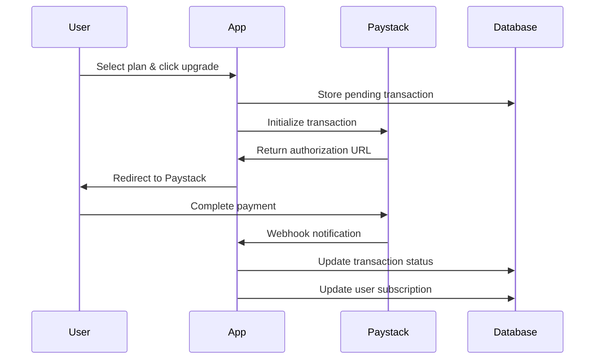
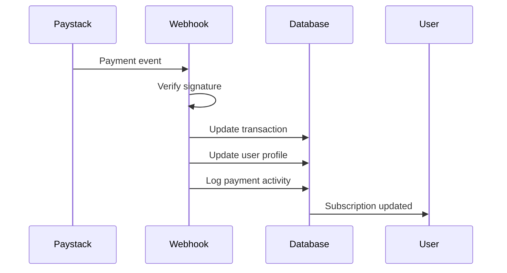

# 🚀 Paystack Payment Integration Setup Guide

## **Overview**

This guide will help you set up Paystack payment integration for subscription management in your AI Agent Builder application.

---

## **📋 Prerequisites**

### **1. Paystack Account**
- Sign up for a Paystack account at [paystack.com](https://paystack.com)
- Complete account verification
- Get your API keys from the dashboard

### **2. Environment Variables**
Add the following environment variables to your `.env.local` file:

```bash
# Paystack Configuration
PAYSTACK_SECRET_KEY=sk_test_your_secret_key_here
NEXT_PUBLIC_PAYSTACK_PUBLIC_KEY=pk_test_your_public_key_here
PAYSTACK_WEBHOOK_SECRET=your_webhook_secret_here

# Application URL
NEXT_PUBLIC_APP_URL=http://localhost:3000

# Supabase Configuration (if not already set)
NEXT_PUBLIC_SUPABASE_URL=your_supabase_url
SUPABASE_SERVICE_ROLE_KEY=your_service_role_key
```

---

## **🔧 Setup Steps**

### **Step 1: Database Migration**

Run the database migration to create the payment transactions table:

```bash
# If using Supabase CLI
supabase db push

# Or manually run the SQL in your Supabase dashboard
```

### **Step 2: Configure Paystack Plans**

The plans are configured in `lib/paystack.ts`. You can modify the `PAYSTACK_PLANS` object to match your pricing:

```typescript
export const PAYSTACK_PLANS = {
  free: {
    name: 'Free Plan',
    amount: 0,
    max_usage: 50,
    features: ['Basic AI agents', 'Email support', 'Community forum access'],
  },
  pro: {
    name: 'Pro Plan',
    amount: 2999, // $29.99 in kobo (smallest currency unit)
    max_usage: 1000,
    features: ['Unlimited workflow executions', 'Advanced AI agents', 'Priority support', 'All integrations'],
  },
  business: {
    name: 'Business Plan',
    amount: 9999, // $99.99 in kobo
    max_usage: 10000,
    features: ['Team collaboration', 'Advanced analytics', 'Dedicated support', 'Custom branding'],
  },
  enterprise: {
    name: 'Enterprise Plan',
    amount: 29999, // $299.99 in kobo
    max_usage: -1, // Unlimited
    features: ['Unlimited team members', 'Custom integrations', 'Dedicated account manager', 'SLA guarantees'],
  },
}
```

### **Step 3: Set Up Webhooks**

1. **Go to your Paystack Dashboard**
2. **Navigate to Settings → Webhooks**
3. **Add a new webhook with the following URL:**
   ```
   https://your-domain.com/api/paystack/webhook
   ```
4. **Select the following events:**
   - `charge.success`
   - `subscription.create`
   - `subscription.disable`
   - `invoice.payment_failed`
5. **Copy the webhook secret and add it to your environment variables**

### **Step 4: Test the Integration**

1. **Start your development server:**
   ```bash
   npm run dev
   ```

2. **Navigate to the billing page:**
   ```
   http://localhost:3000/dashboard/billing
   ```

3. **Test with Paystack test cards:**
   - **Success:** `4084 0840 8408 4081`
   - **Declined:** `4084 0840 8408 4082`
   - **Insufficient Funds:** `4084 0840 8408 4083`

---

## **🔐 Security Considerations**

### **1. Webhook Verification**
The webhook handler verifies the signature to ensure requests come from Paystack:

```typescript
if (!paystackService.verifyWebhookSignature(body, signature)) {
  return NextResponse.json({ error: 'Invalid signature' }, { status: 401 })
}
```

### **2. Environment Variables**
- Never commit API keys to version control
- Use different keys for development and production
- Rotate keys regularly

### **3. Database Security**
- Row Level Security (RLS) is enabled on payment tables
- Users can only access their own payment data
- All sensitive data is encrypted

---

## **📊 Payment Flow**

### **1. Payment Initialization**


### **2. Webhook Processing**


---

## **🛠️ API Endpoints**

### **1. Initialize Payment**
```http
POST /api/paystack/initialize
Content-Type: application/json

{
  "planId": "pro"
}
```

**Response:**
```json
{
  "success": true,
  "authorization_url": "https://checkout.paystack.com/...",
  "reference": "REF_1234567890",
  "access_code": "ACCESS_CODE_123"
}
```

### **2. Verify Payment**
```http
POST /api/paystack/verify
Content-Type: application/json

{
  "reference": "REF_1234567890"
}
```

**Response:**
```json
{
  "success": true,
  "message": "Payment verified successfully",
  "plan": "Pro Plan",
  "transaction": {
    "id": "1234567890",
    "amount": 2999,
    "status": "success"
  }
}
```

### **3. Webhook Handler**
```http
POST /api/paystack/webhook
X-Paystack-Signature: signature_hash
Content-Type: application/json

{
  "event": "charge.success",
  "data": {
    "id": 1234567890,
    "reference": "REF_1234567890",
    "amount": 2999,
    "status": "success",
    "metadata": {
      "user_id": "user_uuid",
      "plan_id": "pro",
      "plan_name": "Pro Plan",
      "max_usage": 1000
    }
  }
}
```

---

## **📈 Monitoring & Analytics**

### **1. Payment Metrics**
Track the following metrics in your dashboard:
- Payment success rate
- Average transaction value
- Subscription conversion rate
- Churn rate

### **2. Error Handling**
Monitor for common payment errors:
- Insufficient funds
- Expired cards
- Network issues
- Webhook failures

### **3. Logs**
All payment activities are logged in the `usage_logs` table with metadata for debugging and analytics.

---

## **🔧 Troubleshooting**

### **Common Issues**

#### **1. Webhook Not Receiving Events**
- Check webhook URL is correct
- Verify webhook secret in environment variables
- Check server logs for errors
- Ensure webhook endpoint is publicly accessible

#### **2. Payment Verification Fails**
- Verify Paystack secret key is correct
- Check transaction reference exists in database
- Ensure user is authenticated
- Verify transaction status in Paystack dashboard

#### **3. Subscription Not Updated**
- Check webhook signature verification
- Verify user ID in transaction metadata
- Check database permissions
- Review RLS policies

### **Debug Commands**

```bash
# Check webhook endpoint
curl -X POST https://your-domain.com/api/paystack/webhook \
  -H "Content-Type: application/json" \
  -d '{"test": "data"}'

# Verify environment variables
echo $PAYSTACK_SECRET_KEY
echo $PAYSTACK_WEBHOOK_SECRET

# Check database connection
supabase db reset
```

---

## **🚀 Production Deployment**

### **1. Environment Setup**
```bash
# Production environment variables
PAYSTACK_SECRET_KEY=sk_live_your_live_secret_key
NEXT_PUBLIC_PAYSTACK_PUBLIC_KEY=pk_live_your_live_public_key
PAYSTACK_WEBHOOK_SECRET=your_production_webhook_secret
NEXT_PUBLIC_APP_URL=https://your-domain.com
```

### **2. SSL Certificate**
Ensure your domain has a valid SSL certificate for secure payment processing.

### **3. Webhook URL**
Update webhook URL to your production domain:
```
https://your-domain.com/api/paystack/webhook
```

### **4. Database Backup**
Set up regular database backups before going live.

---

## **📚 Additional Resources**

### **Paystack Documentation**
- [Paystack API Documentation](https://paystack.com/docs)
- [Webhook Events](https://paystack.com/docs/payments/webhooks)
- [Test Cards](https://paystack.com/docs/payments/test-cards)

### **Support**
- Paystack Support: support@paystack.com
- Technical Documentation: [docs.paystack.com](https://docs.paystack.com)

---

## **✅ Checklist**

- [ ] Paystack account created and verified
- [ ] API keys obtained and configured
- [ ] Environment variables set
- [ ] Database migration run
- [ ] Webhook configured and tested
- [ ] Payment flow tested with test cards
- [ ] Error handling implemented
- [ ] Security measures in place
- [ ] Production environment configured
- [ ] SSL certificate installed
- [ ] Monitoring and logging set up

---

## **🎉 Congratulations!**

Your Paystack payment integration is now complete. Users can upgrade their subscriptions securely, and you can track payments and manage subscriptions through the dashboard.

For any questions or issues, refer to the troubleshooting section or contact support.
